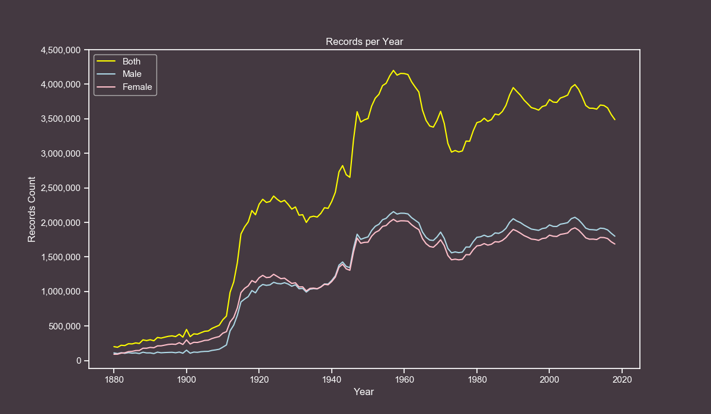
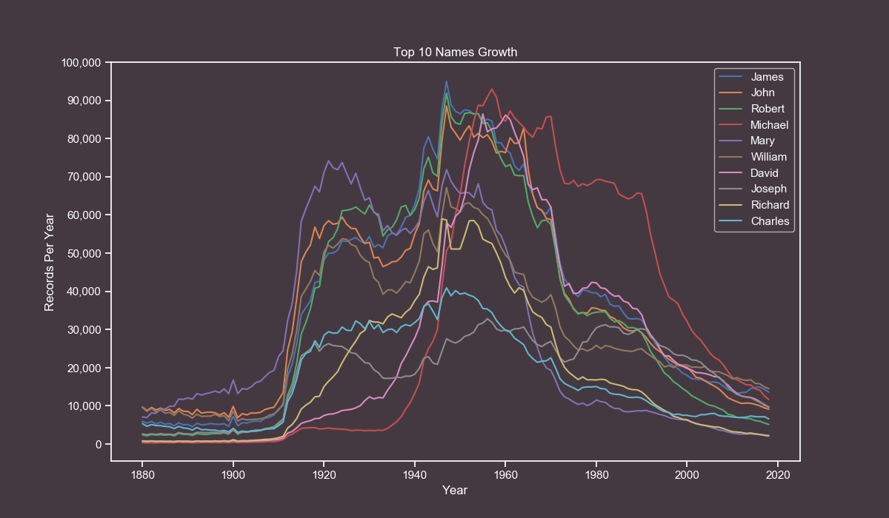
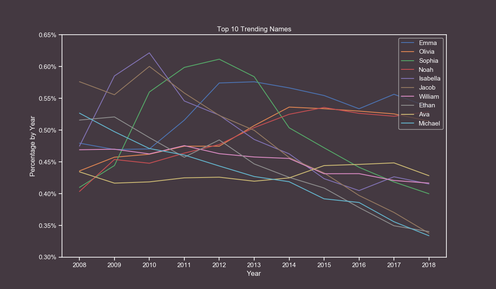

# Data ETL & Analysis Workflow

In this repository I will document the complete process of gathering data, transforming it and presenting it with tables and plots.

The dataset used in this project is the [Baby Names from Social Security Card Applications - National Data](https://catalog.data.gov/dataset/baby-names-from-social-security-card-applications-national-level-data) which includes records from the year 1880 to 2018.

## Requirements

You will only require Python 3 and the following libraries:

* Requests - Used to download the dataset.
* pandas - Used for performing Data Analysis.
* NumPy - Used for fast matrix operations.
* Matplotlib - Used to create plots.
* seaborn - Used to prettify Matplotlib plots.

## Downloading and Transforming (ETL)

The first thing to do is to download the zip file containing all the data. To do so we will only require the `Requests` module.

```python
import requests

url = "https://www.ssa.gov/oact/babynames/names.zip"

with requests.get(url) as response:

    with open("names.zip", "wb") as temp_file:
        temp_file.write(response.content)
```

With only those few lines of code we downloaded the zip file and saved it to our computer, the next step is to extract the files and compute their contents.

The zip file contains txt files that represent each year from 1880 to 2018 and one readme pdf file.

What we are going to do now is to only read into memory the txt files, process their contents and save them into a new csv file.

This new csv file will be our dataset and will include 4 fields (year, name, gender and count).

```python
import csv
from zipfile import ZipFile

# This list will hold all our data. We initialize it with the header row.
data_list = [["year", "name", "gender", "count"]]

# We first read the zip file using a zipfile.ZipFile object.
with ZipFile("names.zip") as temp_zip:

    # Then we read the file list.
    for file_name in temp_zip.namelist():

        # We will only process .txt files.
        if ".txt" in file_name:

            # Now we read the current file from the zip file.
            with temp_zip.open(file_name) as temp_file:

                # The file is opened as binary, we decode it using utf-8 so it can be manipulated as a string.
                for line in temp_file.read().decode("utf-8").splitlines():

                    # We prepare our desired data fields and add them to the data list.
                    line_chunks = line.split(",")
                    year = file_name[3:7]
                    name = line_chunks[0]
                    gender = line_chunks[1]
                    count = line_chunks[2]

                    data_list.append([year, name, gender, count])

# We save the data list into a csv file.
csv.writer(open("data.csv", "w", newline="",
                encoding="utf-8")).writerows(data_list)
```

First we start by declaring `data_list` which will be a 2-dimensional Array (list of lists). The purpose of this is so it can be later saved into a `csv` file using the `csv.writer.writerows()` method. I prefer to use `writerows()` instead of `writerow()` since it is faster as it does it in bulk instead of one row at a time.

Then we open the zip file into memory using a `zipfile.ZipFile()` object. Afterwards we iterate over all the files inside it and only read those that contain actual data.

Since they are read in binary form we decode them using `utf-8` so we can use String manipulation on them.

The txt files content looks like the following example:

```
Ashley,F,9403
Ella,F,9352
Sarah,F,9045
Grace,F,9036
```

We use the string `split(",")` method to separate each line by the comma. Then we will model each data field into their respective variable and append it to the `data_list`.

This newly created csv file can be imported into any `SQL` database or other statistical tools or programming languages. We will continue to use `Python` for this project.

## Data Exploration (EDA)

Now that we have a csv file containing almost two million rows it's time to get some insights from it. For this we will use the `pandas` library.

Fhe first thing to do is to import the libraries using the recommended method.

```python
import matplotlib.pyplot as plt
import numpy as np
import pandas as pd
import seaborn as sns
```

Afterwards we will read the csv file using the `pandas.read_csv()` method.

```python
df = pd.read_csv("data.csv")
```

Since our dataset is very simple we won't require to set any special flags or extra parameters, the default ones are good enough.

Let's start with the classic `df.head()` and `df.tail()` methods which are very handy for taking a sneak peek at the dataset.

```python
# Head (First 5 rows)
df.head()
```

| | year | name | gender | count |
| --- | --- | --- | --- | --- |
| 0 | 1880 | Mary | F | 7065 |
| 1 | 1880 | Anna | F | 2604 |
| 2 | 1880 | Emma | F | 2003 |
| 3 | 1880 | Elizabeth | F | 1939 |
| 4 | 1880 | Minnie | F | 1746 |

```python
# Tail (Last 5 rows)
df.tail()
```

| | year | name | gender | count |
| --- | --- | --- | --- | --- |
| 1957041 | 2018 | Zylas | M | 5 |
| 1957042 | 2018 | Zyran | M | 5 |
| 1957043 | 2018 | Zyrie | M | 5 |
| 1957044 | 2018 | Zyron | M | 5 |
| 1957045 | 2018 | Zzyzx | M | 5 |

These samples tells us several things:

* There are 4 columns (year, name, gender and count).
* There are 1,957,046 rows.
* Rows are sorted by year.
* Female records are shown before male ones.
* At least 5 parents in 2018 named their son 'Zzyzx'.

*Note: The dataset only includes names which have at least 5 records, this is for privacy reasons.*

Let's get more interesting insights.

### Unique Names

There are 98,400 unique names in the dataset. From those, 41,475 are male names, 67,698 are female ones and 10,773 are gender neutral.

```python
# Unique names either gender.
df["name"].nunique()

# Unique names for male.
df[df["gender"] == "M"]["name"].nunique()

# Unique names for female.
df[df["gender"] == "F"]["name"].nunique()

# Unique names for gender neutral.
both_df = df.pivot_table(index="name", columns="gender", values="count", aggfunc=np.sum).dropna()
both_df.index.nunique()
```

### Top 10 Male and Female Names

To get the top 10 most used male and female names we are going to first filter the `dataframe` by gender.

Once we have a gender specific `dataframe` we wiil select only 2 fields, name and count. From there we will use the `groupby()` method on the name field and aggregate the results using a `sum()`.

Finally, we will sort the values on the count field in descending order and use the `Head(10)` method to get the top 10 results.

```python
# Step by step approach, the one-liners can be found below their respective tables.
df = df[df["gender"] == "M"]
df = df[["name", "count"]]
df = df.groupby("name")
df = df.sum()
df = df.sort_values("count", ascending=False)
df.head(10)
```

| Name (Male) | Total Count |
| --- | --- |
| James | 5,164,280 |
| John | 5,124,817 |
| Robert | 4,820,129 |
| Michael | 4,362,731 |
| William | 4,117,369 |
| David | 3,621,322 |
| Joseph | 2,613,304 |
| Richard | 2,565,301 |
| Charles | 2,392,779 |
| Thomas | 2,311,849 |

 ```python
 df[df["gender"] == "M"][["name", "count"]].groupby("name").sum().sort_values("count", ascending=False).head(10)
 ```

| Name (Female) | Total Count |
| --- | --- |
| Mary | 4,125,675 |
| Elizabeth | 1,638,349 |
| Patricia | 1,572,016 |
| Jennifer | 1,467,207 |
| Linda | 1,452,668 |
| Barbara | 1,434,397 |
| Margaret | 1,248,985 |
| Susan | 1,121,703 |
| Dorothy | 1,107,635 |
| Sarah | 1,077,746 |

 ```python
 df[df["gender"] == "F"][["name", "count"]].groupby("name").sum().sort_values("count", ascending=False).head(10)
 ```

### Top 20 Gender Neutral Names

This one was a bit challenging, first we need to pivot the `dataframe` so the names are the index, the genders will be the columns and the sum of all counts (per name, per gender) will be our values.

We are going to do this in small steps. First we pivot the table and drop the rows where the value is 0. This means rows where names are not present in either male or female categories.

```python
df.pivot_table(index="name", columns="gender", values="count", aggfunc=np.sum).dropna()
```

This will output us something like the following table:

| gender | F | M |
| --- | --- | --- |
| name | | |
| Aaden | 5.0 | 4828.0 |
| Aadi | 16.0 | 851.0 |
| Aadyn | 16.0 | 516.0 |
| Aalijah | 149.0 | 212.0 |
| Aaliyah | 87442.0 | 96.0 |

With the data in this shape we now know how many records each name has per gender.

Now we will only take into account those names that atleast have 50,000 records for each gender.

```python
df = df[(df["M"] >= 50000) & (df["F"] >= 50000)]
df.head(20)
```

Finally, we request the top 20 results using the `head(20)` method.

*Note: Originally I was going to only take the top 10 names but I pushed it to 20 since there are only 20 names that meet our criteria.*

| Name | Female Records | Male Records |
| --- | --- | --- |
| Alexis | 338,333 | 63,604 |
| Angel | 95,710 | 231,800 |
| Avery | 125,883 | 55,646 |
| Casey | 76,312 | 110,635 |
| Dana | 191,812 | 53,098 |
| Jackie | 90,705 | 78,494 |
| Jamie | 268,102 | 85,631 |
| Jessie | 167,462 | 110,212 |
| Jordan | 131,004 | 374,513 |
| Kelly | 471,502 | 81,652 |
| Lee | 62,143 | 231,130 |
| Leslie | 267,081 | 112,726 |
| Lynn | 181,904 | 52,268 |
| Marion | 188,391 | 72,075 |
| Riley | 106,901 | 94,278 |
| Shannon | 295,024 | 51,999 |
| Taylor | 320,446 | 110,390 |
| Terry | 96,895 | 422,916 |
| Tracy | 250,853 | 61,223 |
| Willie | 146,156 | 448,946 |


 ### Highest and Lowest Years

Now we will know which years had the highest and lowest amount of records by gender and combined.


```python
both_df = df.groupby("year").sum()
male_df = df[df["gender"] == "M"].groupby("year").sum()
female_df = df[df["gender"] == "F"].groupby("year").sum()

# Combined Min (count and year)
both_df.min()["count"]
both_df.idxmin()["count"])

# Male Min (count and year)
male_df.min()["count"]
male_df.idxmin()["count"]

# Female Min (count and year)
female_df.min()["count"]
female_df.idxmin()["count"]

# Combined Max (count and year)
both_df.max()["count"]
both_df.idxmax()["count"])

# Male Max (count and year)
male_df.max()["count"]
male_df.idxmax()["count"]

# Female Max (count and year)
female_df.max()["count"]
female_df.idxmax()["count"]
```

| Gender and Attribute | Total Count | Year |
| --- | --- | --- |
| Both Min | 192,696 | 1881 |
| Male Min | 100,743 | 1881 |
| Female Min | 90,994 | 1880 |
| Both Max | 4,200,022 | 1957 |
| Male Max | 2,155,711 | 1957 |
| Female Max | 2,044,311 | 1957 |

The year 1881 got the lowest records on the dataset, while the year 1957 got the highest records.

So far we got several interesting insights, it's time to create some pretty plots.

## Plotting the Data

For creating the plots we will use `seaborn` and `matplotlib`, the reason for this is that seaborn applies some subtle yet nice looking effects to the plots.

In this project we are only going to use line plots, which are very helpful for displaying how a value changes over time.

The first thing to do is to set some custom colors that will apply globally to each plot.


```python
# Those parameters generate plots with a mauve color.
sns.set(style="ticks",
        rc={
            "figure.figsize": [12, 7],
            "text.color": "white",
            "axes.labelcolor": "white",
            "axes.edgecolor": "white",
            "xtick.color": "white",
            "ytick.color": "white",
            "axes.facecolor": "#443941",
            "figure.facecolor": "#443941"}
        )
```

With our style declared we are ready to plot our data.

*Note: The next code blocks are more advanced than the previous ones. I also make heavy use of one-liners for efficiency reasons, but don't worry, I will explain what each line does.*

### Counts by Year

Our first plot will consist on how the number of records has moved from 1880 to 2018.

First, we create new dataframes for male, female and combined.

```python
both_df = df.groupby("year").sum()
male_df = df[df["gender"] == "M"].groupby("year").sum()
female_df = df[df["gender"] == "F"].groupby("year").sum()
```

We plot our dataframes directly. The x-axis will be the index and the y-axis will be the total counts.

```python
plt.plot(both_df, label="Both", color="yellow")
plt.plot(male_df, label="Male", color="lightblue")
plt.plot(female_df, label="Female", color="pink")
```

We make our yticks in steps of 50,000. First we format the numbers for the labels. Then we use the actual numbers as the steps.

```python
yticks_labels = ["{:,}".format(i) for i in range(0, 4500000+1, 500000)]
plt.yticks(np.arange(0, 4500000+1, 500000), yticks_labels)
```

We add the final customizations.

```python
plt.legend()
plt.grid(False)
plt.xlabel("Year")
plt.ylabel("Records Count")
plt.title("Records per Year")
plt.show()
```



### Most Popular Names Growth

For our next plot we will observe how the all-time most popular names have grown over the years.

First, we merge values from male and female and pivot the table so the names are our index and the years are our columns. We also fill missing values with zeroes.

```python
pivoted_df = df.pivot_table(index="name", columns="year", values="count", aggfunc=np.sum).fillna(0)
```

Then we calculate the percentage of each name by year.

```python
percentage_df = pivoted_df / pivoted_df.sum() * 100
```
We add a new column to store the cumulative percentages sum.

```python
percentage_df["total"] = percentage_df.sum(axis=1)
```

We sort the dataframe to check which are the top values and slice it. After that we drop the `total` column since it won't be used anymore.

```python
sorted_df = percentage_df.sort_values(by="total", ascending=False).drop("total", axis=1)[0:10]
```

We flip the axes so we can plot the data more easily.

```python
transposed_df = sorted_df.transpose()
```

We plot each name individually by using the column name as the label and Y-axis.

```python
for name in transposed_df.columns.tolist():
    plt.plot(transposed_df.index, transposed_df[name], label=name)
```

We set our yticks in steps of 0.5%.

```python
yticks_labels = ["{}%".format(i) for i in np.arange(0, 5.5, 0.5)]
plt.yticks(np.arange(0, 5.5, 0.5), yticks_labels)
```

We add the final customizations.

```python
plt.legend()
plt.grid(False)
plt.xlabel("Year")
plt.ylabel("Percentage by Year")
plt.title("Top 10 Names Growth")
plt.show()
```



### Top 10 Trending Names

For our last plot we will get the top 10 trending names in the last 10 years (2008-2018).

This one is very similar to the previous one, the first thing to do is to remove all records that are older than 2008.

```python
filtered_df = df[df["year"] >= 2008]
```

Then we merge values from male and female and pivot the table so the names are our index and the years are our columns. We also fill missing values with zeroes.

```python
pivoted_df = filtered_df.pivot_table(index="name", columns="year", values="count", aggfunc=np.sum).fillna(0)
```

Then we calculate the percentage of each name by year.

```python
percentage_df = pivoted_df / pivoted_df.sum() * 100
```

We add a new column to store the cumulative percentages sum.

```python   
percentage_df["total"] = percentage_df.sum(axis=1)
```

We sort the dataframe to check which are the top values and slice it. After that we drop the `total` column since it won't be used anymore.

```python
sorted_df = percentage_df.sort_values("total", ascending=False).drop("total", axis=1)[0:10]
```

We flip the axes so we can plot the dataframe more easily.

```python
transposed_df = sorted_df.transpose()
```

We plot each name individually by using the column name as the label and Y-axis.

```python
for name in transposed_df.columns.tolist():
    plt.plot(transposed_df.index, transposed_df[name], label=name)
```

We set our yticks in steps of 0.05%.

```python
yticks_labels = ["{:.2f}%".format(i) for i in np.arange(0.3, 0.7, 0.05)]
plt.yticks(np.arange(0.3, 0.7, 0.05), yticks_labels)
```

We set our xticks in steps of 1, from 2008 to 2018.

```python
xticks_labels = ["{}".format(i) for i in range(2008, 2618+1, 1)]
plt.xticks(np.arange(2008, 2018+1, 1), xticks_labels)
```

We add the final customizations.

```python
plt.legend()
plt.grid(False)
plt.xlabel("Year")
plt.ylabel("Percentage by Year")
plt.title("Top 10 Trending Names")
plt.show()
```



## Conclusion

I wanted to work on this project for quite some time and I finally got the time to do it. Years ago I worked with this dataset in another project but I always wanted to get the hidden insights from it.

I hope you had fun reading it and you have learned some new skills.

As always, if you have any questions feel free to open an issue and I will try to answer them in a timely manner.

[](https://www.patreon.com/bePatron?u=20521425)
